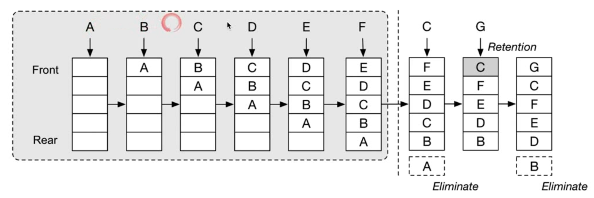
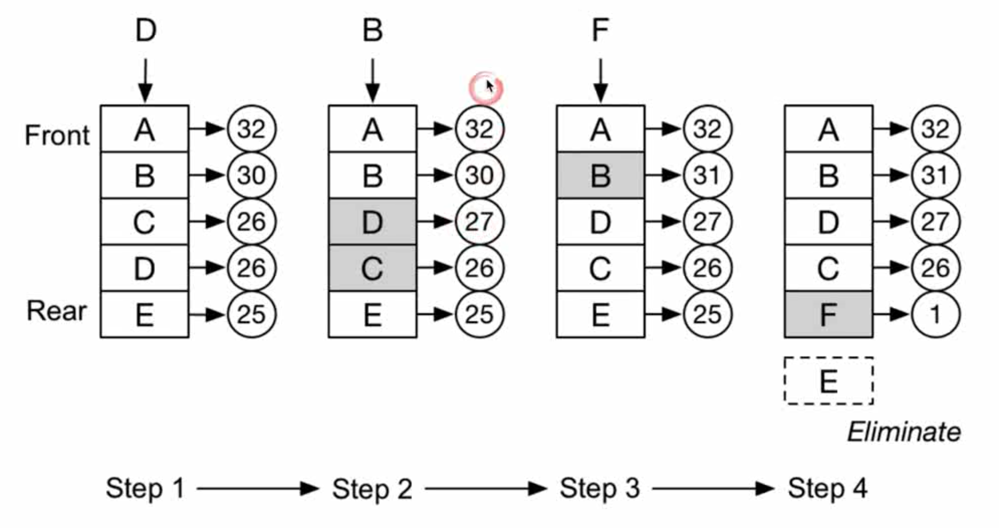

### 146. LRU 缓存机制

https://leetcode-cn.com/problems/lru-cache/


#### Least Recently Used 缓存替换算法


O(1) 查询
O(1) 修改、更新


#### Least Frequently Used

与LRU相比较，多了访问次数排序

```js
class DoubleLinkedListNode {
  constructor(key, value) {
    this.key = key
    this.value = value
    this.prev = null
    this.next = null
  }
}

class LRUCache {
  constructor(capacity) {
    this.capacity = capacity
    this.hashMap = {}
    this.dummyHead = new DoubleLinkedListNode(null, null)
    this.dummyTail = new DoubleLinkedListNode(null, null)
    this.dummyHead.next = this.dummyTail
    this.dummyTail.prev = this.dummyHead
  }

  _isFull() {
    return Object.keys(this.hashMap).length === this.capacity
  }

  _removeNode (node) {
    node.prev.next = node.next
    node.next.prev = node.prev
    node.next = null
    node.prev = null
    return node
  }

  _addToHead(node) {
    const head = this.dummyHead.next
    node.next = head
    head.prev = node
    node.prev = this.dummyHead
    this.dummyHead.next = node
  }

  get(key) {
    if (key in this.hashMap) {
      const node = this.hashMap[key]
      this._addToHead(this._removeNode(node))
      return node.value
    } else {
      return -1
    }
  }

  put(key, value) {
    if (key in this.hashMap) {
      const node = this.hashMap[key]
      node.value = value
      this._addToHead(this._removeNode(node))
    } else {
      if (this._isFull()) {
        const node = this.dummyTail.prev
        delete this.hashMap[node.key]
        this._removeNode(node)
      }
      const node = new DoubleLinkedListNode(key, value)
      this.hashMap[key] = node
      this._addToHead(node)
    }
  }
}
```