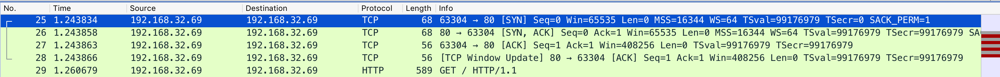

## 通过wireshark学习三次握手

1.243866 - 1.243834 = 0.000032。通过0.032毫秒完成三次握手，建立连接

客户端和服务端都是本地地址：192.168.32.69。服务端端口：80，客户端地址：63304

- win 窗口字段，控制对方的发送数据量

1. 客户端主动打开连接，发送SYN报文。seq=0，len=0。协商window size（win）65535
  - 客户端为syn_sent
  - 服务端为syn_recv
2. 服务端接受SYN，回复SYN+ACK报文。 seq=0，ack=1=0+1。确认自己最大window size（win）为65535
  - 客户端为established
  - 服务端为syn_recv
3. 接到到syn 回复ack seq=1 ack=1=0+1  至此三次握手成功建立。
  - 客户端为established
  - 服务端为established

- 客户端向服务端发送 tcp window update，表示buffer已经清空。并提示服务端现在已经有足够的window 大小