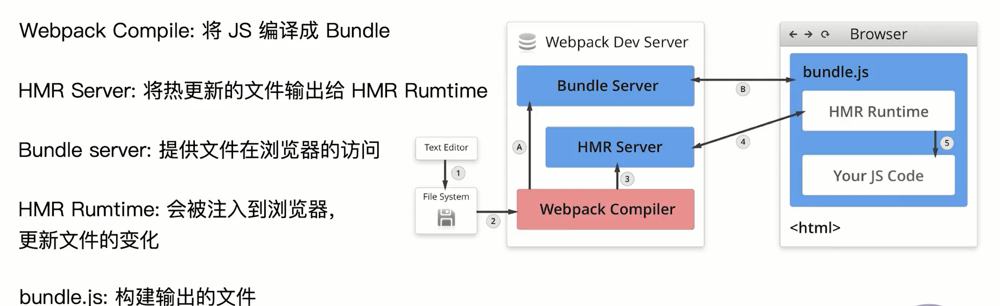
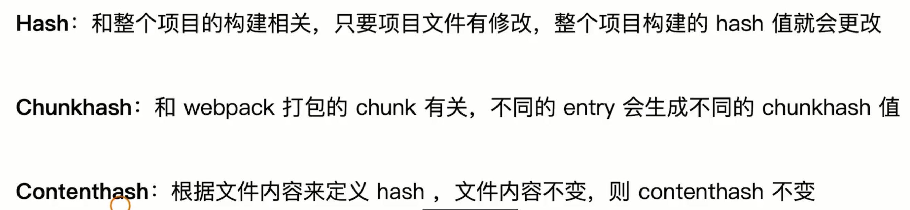

#### 动态polyfill（polyfill service）


#### `tree shaking`利用ES6模块的特点
  - 只能作为模块顶层语句出现

  - import 模块名只是字符串常量 

  - import binding 是 immutable （不可修改） 

cjs则不同，可动态引入，需要时引入。

本质`tree shaking`需要`静态分析`出哪些代码不需要用到，而非运行时分析。在ugly时候去掉


原理：擦出DCE (dead code elimination)
- 代码不会被执行
- 代码执行结果不会被用到
- 代码只会影响死变量


#### 文件监听原理分析

轮询判断文件的最后编辑时间是否变化

某个文件发生了变化，并不会立即告诉监听者，先缓存起来，等待aggregateTimeout

```js
module.exports = {
  watch: true,
  watchOptions: {
    // 监听到变化后会等300ms再去执行构建
    aggregateTimeout: 300,
    // 判断文件是否变化，是通过不停询问系统指定的文件，是否发生变化。
    // 每秒询问1000次
    poll: 1000
  }
}
```


### 热更新原理

依赖`webpack-dev-server`和`webpack.hotModuleReplacementPlugin`

不涉及磁盘的IO文件输出，存放在内存中，速度更快。



`hmr runtime`和`hmr server`以websocket形式连接

启动：1 -> 2 -> A -> B
发生变化：1 -> 2 -> 3 -> 4 -> 5

[详细实现](https://github.com/zouyifeng/webpack-hmr)


### 文件指纹



- chunkhash用法
一般来说，针对于输出文件，我们使用chunkhash。

因为webpack打包后，最终每个entry文件及其依赖会生成单独的一个js文件。

此时使用chunkhash，能够保证整个打包内容的更新准确性。

- contenthash用法
对于css文件来说，一般会使用MiniCssExtractPlugin将其抽取为一个单独的css文件。

类似js资源引用css资源，css用了chunkhash，如果仅js发生了变化，也会引起css文件名字的变化

此时可以使用contenthash进行标记，确保css文件内容变化时，可以更新hash。

- hash用法
一般来说，没有什么机会直接使用hash。

hash会更据每次工程的内容compilation进行计算，很容易造成不必要的hash变更，不利于版本管理。

- file-loader的hash

明明经常看到在处理一些图片，字体的file-loader的打包时，使用的是[name]_[hash:8].[ext]

但是如果改了其他工程文件，比如index.js，生成的图片hash并没有变化。

这里需要注意的是，file-loader的hash字段，这个loader自己定义的占位符，和webpack的内置hash字段并不一致。

这里的hash是使用md4等hash算法，对文件内容进行hash。

所以只要文件内容不变，hash还是会保持一致。


### 懒加载

commonjs： require.ensure

es6：动态import，原理通过jsonp请求把脚本加载进来


### webpack构建优化

https://github.com/zouyifeng/geektime-webpack-course/


### webpack构建组件库

`library`: 指定库的全局变量名字  // 暴露出来库的名字

`libraryTarget`: 支持库的引入方式    // var / window / global / this / umd(支持cjs, amd, esmodule, script)

`libraryExport`: 'default'  // 避免使用时候频繁使用xxx.default

`package.json`的`script`字段`prepublish`，调用`npm publish`会执行