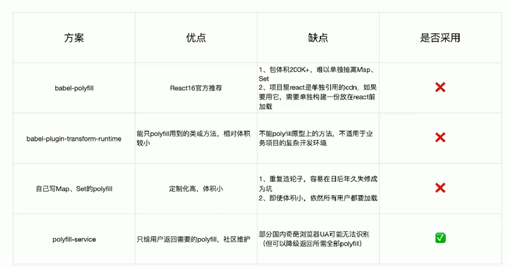

webpack中`output`的属性设置

`library`: 指定库的全局变量

`libraryTarget`: 支持库的引入方式

`libraryExport`: default

`package.json`的`script`字段`prepublish`，调用`npm publish`会执行

webpack优化方案:

动态polyfill（polyfill service）

`tree shaking`利用ES6模块的特点

只能作为模块顶层语句出现

import 模块名只是字符串常量

import binding 是 immutable （不可修改）

cjs则不同，可动态引入，需要时引入。

`tree shaking`需要静态分析出哪些代码不需要用到，而非运行时分析。在ugly时候去掉