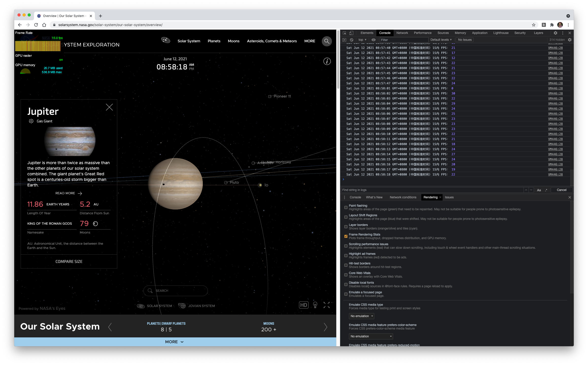

### 动画帧率

- 对于 JS动画而言，它们运行时的帧率即是主线程和合成线程加起来消耗的时间。
- 对于 CSS 动画而言，由于其流程不受主线程的影响，所以希望能得到合成线程的消耗的时间，而合成线程的绘制频率也反映了滚动和 CSS 动画的流程性。


#### Frame Timing API 

```js
var rAF = function () {
    return (
        window.requestAnimationFrame ||
        window.webkitRequestAnimationFrame ||
        function (callback) {
            window.setTimeout(callback, 1000 / 60);
        }
    );
}();
  
var frame = 0;
var lastTime = Date.now();

var loop = function () {
    var now = Date.now();

    frame++;
  
    if (now > 1000 + lastTime) {
      console.log(now - lastTime)
        var fps = Math.round((frame * 1000) / (now - lastTime))   // 1000 / (now -lastTime)  * 
        console.log(`${new Date()} 1S内 FPS：`, fps)
        frame = 0
        lastTime = now
    };
  
    rAF(loop);
}
 
loop();
```

打开[NASA页面](https://solarsystem.nasa.gov/solar-system/our-solar-system/overview/)，打开控制台`Frame Rendering Stats`和上述代码输入控制台，进行对比
